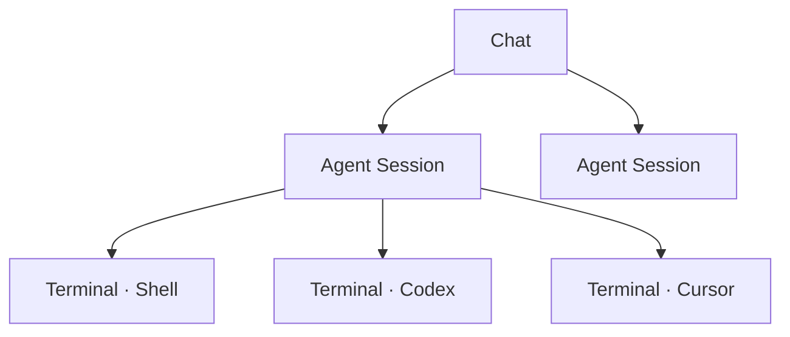
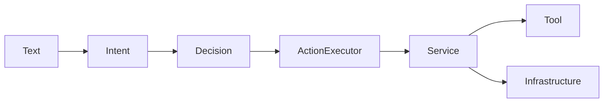
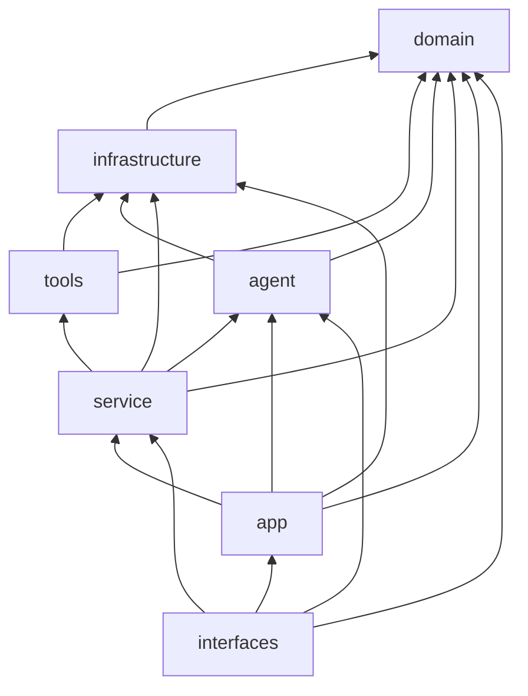

# 架构约定

> 扩展功能时，不要把 Telegram、tmux、文件存储、意图判断和业务流程混进同一个文件。

导航：[文档首页](../README.md) · [产品](../product.md) · [主流程](interaction.md) · [状态机](sessions.md) · [Intent](intents.md) · [测试](../engineering/testing.md) · [路线图](../roadmap.md)

---

## 核心模型

一个 Chat 下挂多个 Agent Session；每个 Agent Session 下挂多个 Terminal Session。



| 概念 | 含义 |
|---|---|
| **Agent Session** | 聊天里的一段独立工作流，有状态与上下文 |
| **Terminal Session** | 一个真实 tmux 终端，归属某个 Agent Session |
| **当前 Session** | 每个 chat 始终应有一个；首次消息时自动创建 `Initial` |

---

## 目录职责

```text
src/
├── app/             装配 + 一轮交互编排
├── service/         用例（Session / Terminal / Workspace / Shell / Chat …）
├── agent/           意图、策略、上下文、规划
├── domain/          纯业务模型（无 IO / 无渠道 SDK）
├── tools/           Agent 可调用的原子能力
├── infrastructure/  tmux、HTTP、LLM、本地持久化
├── interfaces/      Telegram 等渠道适配
└── shared/          跨层小型通用能力
```

### app

| 文件 | 职责 |
|---|---|
| `application.rs` | 启动与全局依赖装配 |
| `state.rs` | 进程级共享依赖 |
| `interaction.rs` | 一轮交互：读 Session → 意图 → 路由 → 执行 |
| `action_executor.rs` | 把 `Decision.action` 分发到 Service |
| `agent_runtime.rs` | Agent 运行时状态与对外行为方法 |

`interaction.rs` 里不要写 Telegram API、tmux 命令或 JSON 读写。

### service

按用例划分，优先复用已有 Service：

| Service | 用例 |
|---|---|
| `session_service` | 创建 / 关闭 / 列表 / 切换 |
| `terminal_service` | 创建 / 切换 / 关闭 / 转发 |
| `workspace_service` | 目录列表与解析 |
| `shell_service` | 候选命令、校验、确认、取消、编辑 |
| `chat_service` | Agent 普通聊天 |
| `system_service` | 帮助、介绍、重置 |

不要直接摸 Agent 内部的 `Mutex<HashMap<...>>`，走行为方法：

```rust
state.selected_cli(chat).await;
state.set_pending_workspace(chat, pending).await;
state.take_pending_shell_command(chat).await;
```

用户反馈优先走 `service::output::ChatOutput`，别把 Telegram Presenter / 键盘逻辑拉回 Service。

### agent

| 子目录 | 职责 |
|---|---|
| `intent/` | 文本 → Intent；规则优先，模型兜底 |
| `policy/` | Shell 白名单等安全限制 |
| `context/` | 模型上下文（规划中） |
| `planner/` | 多步规划（P0/P1 不要塞业务动作） |

意图层只回答「用户想做什么」，不操作 tmux / 文件 / Telegram。



### domain

只放稳定业务数据，例如：`Session`、`SessionState`、`PendingLaunch`、`PendingShellCommand`、`TerminalKind`、`AgentKind`。

禁止出现：`Bot` / `ChatId`、`reqwest` / `tmux`、`fs::read`、`Mutex`、`Config`、`AppState`。

### infrastructure

| 模块 | 职责 |
|---|---|
| `persistence/session_store.rs` | Session JSON 快照 |
| `persistence/context_store.rs` | JSONL 上下文 |
| `persistence/terminal_store.rs` | 终端记录与 tmux 恢复 |
| `llm_client.rs` | **唯一**模型 HTTP 入口 |
| `tmux_runner.rs` | tmux 命令封装 |

新模型调用必须复用 `llm_client`，不要在 Service 里自己建 `reqwest::Client`。

### interfaces

```text
interfaces/
├── channel.rs
├── registry.rs
└── channels/telegram/
```

接飞书 / 钉钉：新建 `channels/<name>`，实现 `Channel` 并注册。不要改业务 Service 去判断渠道类型。

---

## 依赖方向

只允许向内依赖：



硬禁止：

| 禁止 | 原因 |
|---|---|
| `domain → app` | domain 必须可独立理解 |
| `domain → interfaces` | 渠道 SDK 不得渗入领域层 |
| `service → interfaces/channels/telegram` | Service 应走 `ChatOutput` |

---

## 命名约定

| 场景 | 命名 |
|---|---|
| 一轮完整交互 | `interaction.rs` → `interaction::run(...)` |
| 业务用例 | `*_service.rs` |
| 持久化读写 | `*_store.rs` |
| 原子外部能力 | `tools/*` |
| 平台协议适配 | `interfaces/channels/<channel>` |

不要新建 `utils` / `common` / `helper` 这类无边界目录。

---

## 修改前检查

1. 这是 Intent、Decision、Service、Tool，还是 Infrastructure？
2. 新状态是否进 `domain`，并由 `persistence` 持久化？
3. 是否已有可复用的 Service / Tool / LlmClient / Store？
4. 有没有把 Telegram、tmux、文件读写混进 `domain` 或 `agent`？
5. 是否应通过 `ChatOutput` 回复，而不是直接依赖 Telegram？
6. 改完执行：

```bash
cargo fmt
cargo test
```

---

## 文档维护

`architecture.md` 是代码的一部分。下列变更必须同提交更新本文：

- 增删移动模块 / Service / Tool / Store / Channel
- 改职责、依赖方向或对外接口
- 改领域模型、Session / Terminal 状态、Intent / Decision / Action
- 改主流程、持久化格式或渠道交互
- 完成或替换下方「渐进式重构」条目

局部实现细节、小 Bug、纯测试补充可不动本文。重要结构变化时，在下方追加一条记录。

### 变更记录

| 日期 | 内容 |
|---|---|
| 2026-09-04 | 新增 `ChatOutput`；Chat / System / Session Service 开始脱离 Telegram 输出 |
| 2026-09-04 | `agent_flow.rs` → `interaction.rs` |
| 2026-09-04 | Session / Context 持久化从 `domain` 拆到 `infrastructure/persistence` |

### 渐进式重构

**已完成**

- Session 模型与 Session / Context 持久化分离
- 去掉 `domain → app` 的 PendingLaunch 反向依赖
- Agent 的 CLI / 待目录 / 待 Shell 状态收敛为行为方法
- Chat / System / Session Service 接入 `ChatOutput`
- Telegram 作为可注册 Channel

**待继续**

- Workspace / Shell / CLI / Terminal Service 迁到 `ChatOutput`
- tmux 实时输出抽象为渠道无关流式端口
- 继续收敛 Agent 对 TerminalManager / WorkspaceTool / TerminalTool 的直接暴露
