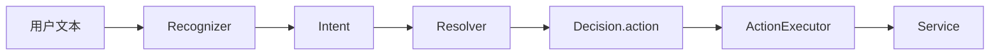

# Intent、Decision 与 Action

> 规则优先；未命中再按 Session Profile 决定模型分类、聊天、目录输入、终端输入或 Shell 建议。

导航：[文档首页](../README.md) · [架构](architecture.md) · [状态机](sessions.md)

---

## 链路



---

## 新增意图检查单

配置源：`config/intents.yaml`。每加一条意图，按序确认：

1. YAML 中的 `name`、`action`、描述、示例
2. `IntentCatalog` 校验通过
3. `Resolver` 能生成对应 `Decision`
4. `app/action_executor.rs` 有分发分支
5. 目标 Service 与测试已落地

---

## 主要映射

| Intent | Action | Service |
|---|---|---|
| `new_session` | `session.create` | `session_service` |
| `close_session` | `session.close` | `session_service` |
| `list_session` | `session.list` | `session_service` |
| `switch_session` | `session.switch` | `session_service` |
| `choose_cli` | `cli.choose` | `cli_service` |
| `open_terminal` | `terminal.open` | `terminal_service` |
| `list_directories` | `workspace.list` | `workspace_service` |
| `shell_confirm` | `shell.confirm` | `shell_service` |
| `reset` | `session.reset` | `system_service` |
| `agent_chat` | `agent.chat` | `chat_service` |

---

## 特殊输入

| 输入 | 行为 |
|---|---|
| `/agent_session <id>` | 切换 Agent Session |
| `/terminal <id>` | 切换 Terminal Session |
| `/reset` | 清空当前 chat 受管数据 |
| `$<cmd>` / `!<cmd>` | 直接 Shell 输入，跳过模型候选 |
| `修改为：<cmd>` | 仅在等待 Shell 确认时编辑候选 |

---

## Recognition Profile：状态驱动的意图路由

`RecognitionProfile` 根据当前 Agent Session 与当前 Terminal 决定：本轮允许哪些控制意图，以及未命中规则的普通文本应该去哪里。

| 当前 Session 情况 | 优先识别方向 | 未命中规则时的去向 |
|---|---|---|
| 初始化，无终端 | Agent 聊天、打开 Shell、CodeX、Cursor、会话管理、系统帮助 | Agent Chat / 模型兜底 |
| 等待目录 | 目录序号、目录路径、列目录、取消、系统帮助 | Workspace Input |
| 有 Shell Terminal | Shell 请求、会话管理、终端管理、系统帮助 | Shell Request |
| 有 CodeX Terminal | CodeX 任务输入、会话管理、终端管理、系统帮助 | CLI Input（转发 CodeX） |
| 有 Cursor Terminal | Cursor 任务输入、会话管理、终端管理、系统帮助 | CLI Input（转发 Cursor） |
| 多终端未选择当前终端 | Agent 聊天、终端列表、切换终端、创建终端、会话管理 | Agent Chat / 模型兜底 |
| 等待 Shell 确认 | 确认、取消、修改命令、帮助、重置 | Waiting Shell Confirmation |

规则优先级：

```text
确定性规则 / 斜杠命令
→ Profile 是否允许该 Intent
→ 状态专属输入处理
→ 模型分类或 Profile 的普通文本兜底
```

严格 Profile：

- `WaitingWorkspace`：普通文本只能作为目录输入，不能误发至旧终端。
- `WaitingShellConfirmation`：普通文本不能直接执行或转发；只允许确认、取消、编辑和受限系统操作。

实现位置：`src/agent/intent/profile.rs`。修改 Profile 允许列表或兜底策略时，必须同步更新本节、状态机测试和对应人工测试。
