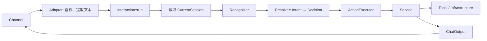

# Interaction Flow

> 一轮用户交互从渠道收到文本开始，到业务执行与消息输出结束。

导航：[文档首页](../README.md) · [架构](architecture.md) · [状态机](sessions.md) · [Intent](intents.md)

---

## 主链路



## 处理顺序

1. Channel Adapter 接收平台消息，校验用户身份，提取非空文本。
2. `Agent::run` 进入 `app::interaction::run`。
3. 获取 chat 串行锁，避免并发消息破坏 Session 状态。
4. 读取 `CurrentSession`：当前 Session、交互状态与当前终端可用性。
5. 记录用户上下文。
6. `Recognizer` 使用 `RecognitionProfile` 识别文本。
7. 根据 `IntentRoute` 路由到 Action、目录输入、CLI 输入或 Shell 请求。
8. Service 调用 Tool / Infrastructure，更新并持久化状态。
9. Service 通过 `ChatOutput` 输出结果；具体渠道负责平台 API。

## 路由分支

| Route | 示例 | 入口 |
|---|---|---|
| `Action` | `打开终端`、`CodeX`、`会话列表`、`/reset` | `ActionExecutor` |
| `WorkspaceInput` | `1`、目录路径 | `workspace_service::launch` |
| `CliInput` | CodeX / Cursor 任务文本 | `terminal_service::forward` |
| `ShellRequest` | Shell 中的自然语言需求 | `shell_service::suggest` |

## 关键优先级

```text
鉴权 → chat 串行锁 → CurrentSession → 确定性规则 → Profile 限制
→ 状态专属输入 → 模型兜底 → Action / Service
```

- 等待目录：普通文本只能是目录输入。
- 等待 Shell 确认：普通文本不能直接执行或转发。
- CodeX / Cursor 当前终端：普通文本默认转发。
- Shell 当前终端：普通文本默认生成待确认命令。
- 无当前终端：普通文本进入 Agent Chat 或模型意图兜底。

## 相关代码

| 职责 | 位置 |
|---|---|
| 交互编排 | `src/app/interaction.rs` |
| 运行时状态 | `src/app/agent_runtime.rs` |
| 意图识别 | `src/agent/intent/` |
| Decision | `src/agent/resolver.rs` |
| Action 分发 | `src/app/action_executor.rs` |
| 用例实现 | `src/service/` |
| Telegram Adapter | `src/interfaces/channels/telegram/` |

## 维护规则

交互入口、路由顺序、`IntentRoute`、ActionExecutor、输出端口或渠道适配方式发生变化时，必须同步更新本文件。
