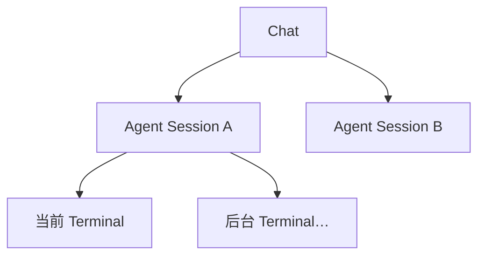
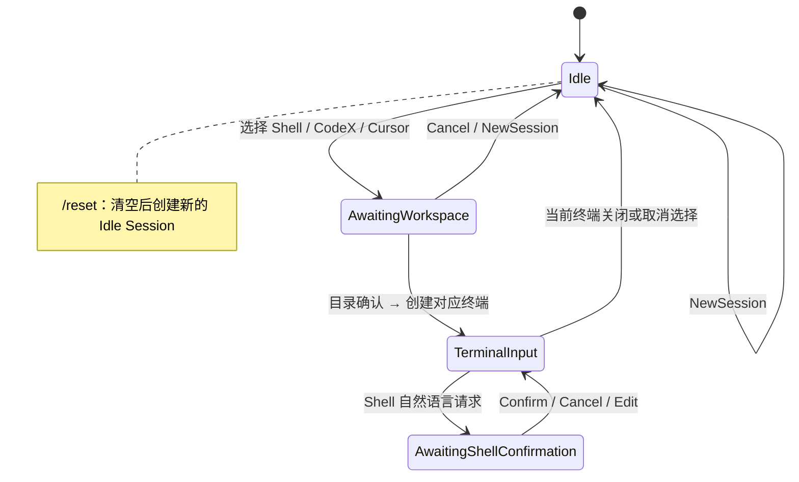

# Session 与 Terminal 状态机

> Chat → Agent Session → Terminal Session。同一时刻最多一个当前 Terminal。

导航：[文档首页](../README.md) · [架构](architecture.md) · [Intent](intents.md)

---

## 层级



一个 Chat 可有多个 Agent Session；每个 Agent Session 可有多个 Terminal，但同一时刻最多选中一个当前 Terminal。

---

## 状态职责

不要用一个状态同时表达会话生命周期、用户输入模式和 tmux 运行情况：

| 维度 | 当前 / 目标职责 |
|---|---|
| `SessionStatus` | Agent Session 是否仍可切换：`Active` / `Closed` |
| `InteractionState`（当前代码名为 `SessionState`） | 用户下一条消息应该如何识别与路由 |
| `TerminalStatus` | tmux 是否真实可用：`Running` / `Stopped` / `Missing` |

“有多个终端但未选当前终端”是 Terminal Manager 的组合状态，不应硬编码为一个持久化 Session 状态：它表示当前 Agent Session 有终端记录，但 `current terminal = None`。

## 当前实现的 SessionState

| 状态 | 含义 | 普通文本去向 |
|---|---|---|
| `Initial` | 新会话，未选 CLI / 终端 | Agent 聊天 / 模型意图兜底 |
| `CliSelected` | 已选 Codex 或 Cursor | 等待或请求目录 |
| `WaitingWorkspace` | 正在选工作目录 | 序号、路径、目录名 |
| `ActiveTerminal` | 有当前 tmux | Shell 请求或直接转发 CLI |
| `WaitingShellCommand` | Shell 候选待确认 | 仅确认 / 取消 / 改命令与受限控制 |

当前实现中 `OpenTerminal(Shell)` 会直接在 Home 创建 Shell；`WaitingWorkspace.kind` 使用 `Option<AgentKind>`，因此无法表示“正在为 Shell 选择目录”。这是一项待收敛的历史实现，不应作为新增功能的范式。

## 目标交互状态

后续重构时，状态应以准备创建的 `TerminalKind` 为中心，而不是只保存 `AgentKind`：

```rust
pub enum InteractionState {
    Idle,
    AwaitingWorkspace {
        terminal: TerminalKind, // Shell / Codex / Cursor
        candidates: Vec<PathBuf>,
    },
    AwaitingShellConfirmation {
        terminal_id: String,
        command: String,
        description: String,
    },
    TerminalInput {
        terminal_id: String,
    },
}
```

`CliSelected` 是瞬时选择结果，不应作为长期稳定状态；选择 CodeX 或 Cursor 后应直接进入 `AwaitingWorkspace`。

## 推荐实现模式：FSM + Reducer + Effect

后续状态重构采用有限状态机（FSM）与 Reducer 模式，而不是在各个 Service 中先修改多个 Map、再反推状态。

```text
用户文本
→ Intent
→ Event
→ transition(current_state, event)
→ next_state + effects
→ 持久化 next_state
→ ActionExecutor 执行 effects
→ Channel 输出结果
```

| 概念 | 职责 | 示例 |
|---|---|---|
| `InteractionState` | 当前用户输入模式；唯一状态来源 | `Idle`、`AwaitingWorkspace` |
| `Event` | 用户或系统刚发生的事情 | `TerminalChosen`、`WorkspaceChosen`、`TerminalMissing` |
| `Transition` | 纯状态转换结果 | `next_state`、`effects` 或拒绝原因 |
| `Effect` | 需要调用外部世界的副作用 | 创建 tmux、列目录、发消息、调用模型 |

建议的 Event：

```rust
pub enum Event {
    TerminalChosen(TerminalKind),
    WorkspaceChosen(PathBuf),
    WorkspaceCancelled,
    ShellRequest(String),
    ShellConfirmed,
    ShellCancelled,
    ShellEdited(String),
    TerminalCreated { terminal_id: String },
    TerminalClosed,
    TerminalMissing,
    NewSession,
    Reset,
}
```

建议的 Effect：

```rust
pub enum Effect {
    AskWorkspace,
    ListWorkspaces,
    CreateTerminal { terminal: TerminalKind, workspace: PathBuf },
    SendToTerminal { terminal_id: String, text: String },
    GenerateShellCommand(String),
    SendMessage(String),
    ClearSession,
}
```

`transition` 必须是纯函数：不调用 tmux、LLM、Telegram、文件系统，也不直接写数据库或 JSON。

```rust
transition(current_state, event) -> Transition
```

这样可单独为每一种状态和事件组合编写单元测试，并避免出现“内存 pending 已更新、持久化状态未更新”的状态漂移。

---

## 主要流转



---

## 不变量

| # | 规则 |
|---|---|
| 1 | 每个 chat 必须能恢复一个当前 Agent Session；缺失则自动创建 |
| 2 | `WaitingWorkspace` 优先消费普通文本，防止目录输入误发终端 |
| 3 | `WaitingShellCommand` 禁止普通文本直接执行或转发 |
| 4 | 切换 Session 时恢复目录候选、待确认 Shell 与当前终端选择 |
| 5 | `/reset` 清除该 chat 的 Session、上下文与受管终端，再新建空闲会话 |
| 6 | 选择 Shell、CodeX、Cursor 后均应使用相同的“选择工作目录 → 创建终端”主流程；Shell 默认 Home 仅在明确保留快捷模式时允许 |
| 7 | 状态转换先生成并持久化 `next_state`，再执行 tmux、LLM、Channel 等副作用；副作用失败必须通过 Event 回写可恢复状态 |
