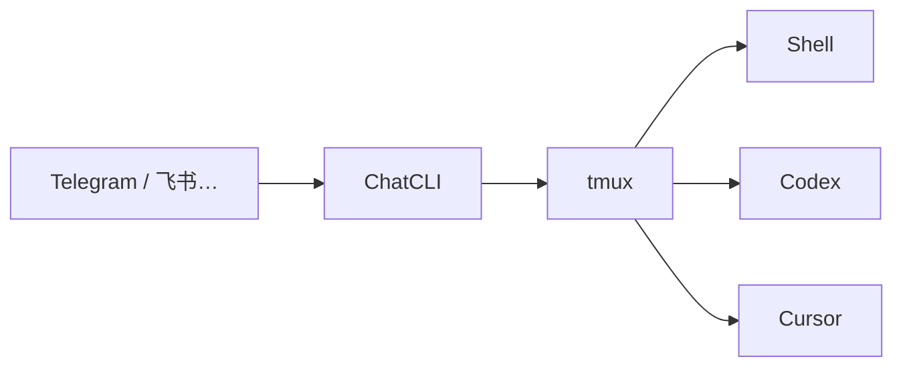

# 产品范围

> ChatCLI 通过聊天渠道管理本机的 Shell、Codex、Cursor 与 tmux 会话。

导航：[文档首页](README.md) · [架构](design/architecture.md) · [状态机](design/sessions.md)

---

## 定位

聊天软件是遥控器；**真实终端才是事实来源**。ChatCLI 不编排模型任务内容，也不冒充云端 IDE。

---

## P0 已支持

| 能力 | 说明 |
|---|---|
| Agent Session | 创建、关闭、列表、切换、`/reset` |
| CLI 启动 | 选工作目录后启动 Codex / Cursor |
| 终端管理 | 创建、查看、切换、关闭 Shell / Codex / Cursor |
| 输入转发 | 普通文本进入当前终端 |
| Shell 确认 | 自然语言 → 候选命令 → 用户确认后执行 |
| Agent 聊天 | 普通对话、帮助、自我介绍 |
| 本地持久化 | Session / 终端 / 上下文的 JSON · JSONL |

---

## 非目标

| 不做 | 原因 |
|---|---|
| 自动执行模型生成的 Shell | 必须用户确认 |
| 「等待目录」时把文本转发旧终端 | 避免误输入 |
| 引入数据库 | 当前阶段本地文件即可 |
| 未授权 Telegram 用户 | 本机白名单 |
| 多人协作 / 云端 IDE | 产品边界之外 |

---

## 交互原则

1. **聊天框为主** — 不依赖 Telegram 底部常驻键盘。
2. **明确控制优先** — 斜杠命令、按钮回调压过普通文本与模型兜底。
3. **无当前终端时可聊** — 普通文本可走 Agent 聊天。
4. **Shell 安全默认** — 自然语言先出待确认命令；`$` / `!` 前缀才是直接输入。
